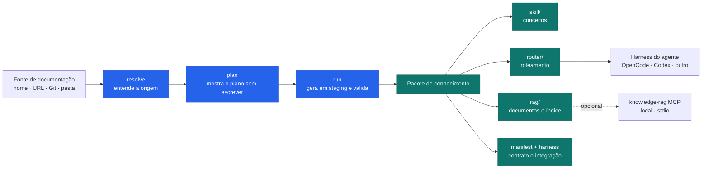
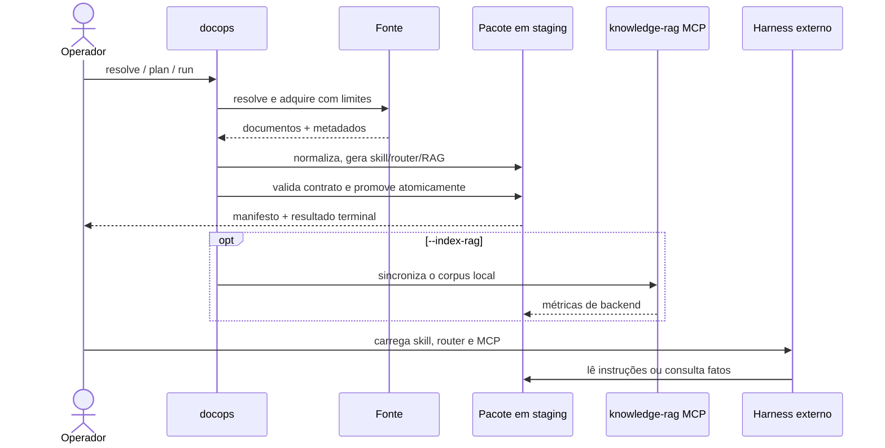

# consulta-documentacao

`consulta-documentacao` 1.1.0

<div align="center">

### Documentação organizada para agentes de IA

Transforme uma documentação em um pacote portátil com **skill**, **roteador**,
corpus pesquisável e evidências verificáveis — sem obrigar o projeto a escolher
um modelo, provedor ou chave de API.

<p>
  <a href="https://github.com/VIDORETTO/agent-knowledge-kit/actions/workflows/ci.yml"></a>
  <a href="https://github.com/VIDORETTO/agent-knowledge-kit/releases"></a>
  
  <a href="https://github.com/VIDORETTO/agent-knowledge-kit/blob/main/LICENSE"></a>
  
</p>

**Versão atual: [`v1.1.0`](https://github.com/VIDORETTO/agent-knowledge-kit/releases/tag/v1.1.0)**

</div>

> **Resumo em uma frase:** o `consulta-documentacao` recebe uma fonte de
> documentação e entrega um pacote que um agente consegue consultar de forma
> organizada, rastreável e opcionalmente com RAG local.

## Índice

- [O que é](#o-que-e)
- [Para que serve](#para-que-serve)
- [Como instalar](#como-instalar)
- [Primeiro uso passo a passo](#primeiro-uso-passo-a-passo)
- [Como desinstalar](#como-desinstalar)
- [O que é gerado](#o-que-e-gerado)
- [Parte técnica](#parte-tecnica)
- [Segurança, licenças e limites](#seguranca-licencas-e-limites)
- [Documentação e suporte](#documentacao-e-suporte)

## O que é

Este projeto é um **orquestrador de documentação para agentes**. Ele pega uma
fonte, como:

- uma pasta ou arquivo local;
- uma página ou site acessível por URL;
- um repositório Git;
- um nome conhecido pelo catálogo configurado;

e monta uma estrutura de conhecimento pronta para ser usada por um harness de
agente, como OpenCode ou Codex.

Pense nele como uma pequena fábrica de biblioteca:

| Peça | Explicação simples |
| --- | --- |
| Documentação | Os livros originais que precisam ser entendidos. |
| `skill/` | O resumo organizado: conceitos, padrões, glossário e orientação. |
| `router/` | O bibliotecário que decide se a pergunta deve usar a skill ou uma busca literal. |
| `rag/` | O índice local para encontrar trechos, defaults, assinaturas e números. |
| `manifest.json` | A etiqueta da caixa: origem, versão, licença, hashes e resultado. |
| `harness.json` | As instruções para conectar o pacote ao agente externo. |

### O que ele não é

- Não é um chatbot.
- Não é um modelo de IA.
- Não escolhe OpenAI, Anthropic, Ollama ou qualquer outro provedor.
- Não cria nem exige uma chave de API.
- Não substitui o OpenCode, Codex, Claude Code ou outro harness.
- Não publica documentação de terceiros automaticamente.

O agente externo continua responsável por carregar a skill, consultar o MCP
quando necessário e escrever a resposta final.

## Para que serve

Ele é útil quando você quer que um agente responda sobre uma tecnologia usando
uma documentação específica, por exemplo:

1. apontar para uma documentação;
2. gerar uma visão conceitual reutilizável;
3. manter uma cópia normalizada dos documentos;
4. buscar fatos exatos com indicação da fonte;
5. validar se o pacote está completo;
6. testar a recuperação com perguntas conhecidas;
7. transportar tudo para outro computador ou harness.

O fluxo visual é este:



## Como instalar

### Opção recomendada: GitHub Release

A versão pública é distribuída pelo GitHub Release. **Ela não está no PyPI.**

1. Abra a [release `v1.1.0`](https://github.com/VIDORETTO/agent-knowledge-kit/releases/tag/v1.1.0).
2. Baixe `consulta_documentacao-1.1.0-py3-none-any.whl` e `SHA256SUMS`.
3. Crie um ambiente virtual na pasta em que deseja trabalhar.
4. Instale a wheel dentro desse ambiente.

No Linux ou macOS:

```bash
python3 -m venv .venv
source .venv/bin/activate
python -m pip install ./consulta_documentacao-1.1.0-py3-none-any.whl
python -m docops --help
```

No Windows PowerShell:

```powershell
py -3.11 -m venv .venv
.\.venv\Scripts\Activate.ps1
python -m pip install .\consulta_documentacao-1.1.0-py3-none-any.whl
python -m docops --help
```

O pacote principal não tem dependências obrigatórias além do Python `3.11+`.
O uso básico funciona sem RAG, sem modelo e sem internet depois que a wheel foi
baixada.

#### Verificação opcional do download

O SHA-256 publicado da wheel `v1.1.0` é:

```text
a6656139143df70974619581129a049b06a9e4511fdb2cf00ff4fd54aa2fc5c1
```

Linux/macOS:

```bash
sha256sum consulta_documentacao-1.1.0-py3-none-any.whl
```

Windows PowerShell:

```powershell
(Get-FileHash .\consulta_documentacao-1.1.0-py3-none-any.whl -Algorithm SHA256).Hash
```

Compare o resultado com a linha correspondente em `SHA256SUMS`.

### Opção para desenvolvimento: clonar o código-fonte

Use esta opção se você pretende alterar o projeto, executar a suíte de testes
ou usar os scripts auxiliares:

```bash
git clone https://github.com/VIDORETTO/agent-knowledge-kit.git
cd agent-knowledge-kit
python scripts/bootstrap.py --dev
python -m docops doctor --json
python -m pytest
```

No Windows, o equivalente é:

```powershell
git clone https://github.com/VIDORETTO/agent-knowledge-kit.git
Set-Location agent-knowledge-kit
python scripts\bootstrap.py --dev
python -m docops doctor --json
python -m pytest
```

O bootstrap cria o ambiente local e instala o projeto em modo editável. Para
habilitar também o RAG local:

```bash
python scripts/bootstrap.py --dev --rag
```

Os scripts equivalentes são `scripts/bootstrap.sh` no Linux/macOS e
`scripts/bootstrap.ps1` no Windows.

> **Nota:** `doctor` foi feito para diagnosticar um checkout do projeto. Se
> você instalou somente a wheel em uma pasta vazia, use diretamente `run`,
> `validate` e `evaluate`; ou aponte `doctor` para um checkout com
> `python -m docops doctor --root /caminho/do/projeto --json`.

## Primeiro uso passo a passo

O exemplo abaixo usa somente a fixture sintética pública do repositório. Ela
não contém documentação de terceiros e pode ser usada sem resolver questões de
copyright.

### 1. Descubra a fonte

```bash
python -m docops resolve ./documents/fixtures/acme-docs --json
```

Esse comando é somente leitura: ele identifica a origem e mostra o que seria
usado. Ele não gera o pacote.

### 2. Veja o plano antes de aplicar

```bash
python -m docops plan ./documents/fixtures/acme-docs \
  --output ./artifacts/acme \
  --slug acme \
  --license MIT \
  --redistribution private-only \
  --json
```

`plan` é uma prévia. Ele calcula mudanças, verifica políticas e aponta
bloqueios sem substituir o pacote de destino.

### 3. Gere o pacote

```bash
python -m docops run ./documents/fixtures/acme-docs \
  --output ./artifacts/acme \
  --slug acme \
  --license MIT \
  --redistribution private-only
```

Para uma fonte real, substitua `./documents/fixtures/acme-docs` por um nome,
URL, repositório ou pasta e informe a licença correta. Não use `MIT` para uma
documentação que não seja MIT.

### 4. Valide o resultado

```bash
python -m docops validate ./artifacts/acme --json
```

Se a validação passar, o pacote tem os arquivos obrigatórios e respeita o
contrato público.

### 5. Veja perguntas candidatas

```bash
python -m docops golden-candidates ./artifacts/acme --json
```

As perguntas geradas são candidatas. Antes de usá-las como avaliação oficial,
uma pessoa deve revisar as perguntas e as fontes esperadas.

### 6. Conecte ao seu agente

Abra `./artifacts/acme/harness.json` e siga as instruções relativas que estão
lá. Em termos simples:

1. carregue `skill/SKILL.md` como uma skill do seu harness;
2. carregue `router/SKILL.md` para ele saber quando usar cada caminho;
3. registre o `knowledge-rag` como MCP stdio se quiser busca factual;
4. faça perguntas ao seu agente.

A regra prática é:

| Tipo de pergunta | Caminho recomendado |
| --- | --- |
| “Qual é o padrão para fazer X?” | `skill/`, para entendimento e orientação. |
| “Qual é o default, assinatura ou versão?” | RAG, para buscar o trecho literal. |
| Pergunta ambígua ou sensível | Skill para raciocinar + RAG para confirmar. |

Respostas factuais devem citar uma origem como `path#secao` ou `path:linha`.

### 7. Indexe o RAG, se realmente precisar

O RAG é opcional. Primeiro instale o perfil RAG no checkout:

```bash
python scripts/bootstrap.py --dev --rag
```

Depois gere o pacote com a indexação real:

```bash
python -m docops run ./documents/fixtures/acme-docs \
  --output ./artifacts/acme \
  --slug acme \
  --license MIT \
  --redistribution private-only \
  --index-rag
```

O MCP padrão é local e usa `stdio`; não é necessário abrir uma porta na rede.
Para testar a recuperação com um Golden Set revisado:

```bash
python -m docops evaluate \
  --package ./artifacts/acme \
  --cases ./golden-set/test-cases-fixture.json \
  --adapter mcp \
  --runtime-root . \
  --json
```

## Como desinstalar

### Remover somente o pacote Python

Ative o mesmo ambiente usado na instalação e rode:

```bash
python -m pip uninstall consulta-documentacao
```

No Windows PowerShell, se preferir não ativar o ambiente:

```powershell
.\.venv\Scripts\python.exe -m pip uninstall consulta-documentacao
```

Esse comando remove o pacote, mas preserva o código-fonte, os pacotes gerados
e o ambiente virtual.

### Remover o ambiente virtual local

Faça isso somente se `.venv` for o ambiente criado para este projeto e não for
usado por outro trabalho.

Linux/macOS:

```bash
rm -rf ./.venv
```

Windows PowerShell:

```powershell
Remove-Item -Recurse -Force .\.venv
```

Se o bootstrap criou `.venv-posix` ou `.venv-windows`, remova somente o
diretório correspondente a este checkout.

### Remover o RAG e os resultados gerados

Se o RAG foi instalado no mesmo ambiente:

```bash
python -m pip uninstall knowledge-rag
```

Para apagar um resultado que você não precisa mais, remova somente a pasta
exata que você criou, por exemplo `./artifacts/acme`. Ela pode conter cópias de
documentos adquiridos e evidências importantes; confira antes de apagar.

O cache de modelos fica fora do pacote, em `~/.cache/docops/models`. Ele é
opcional e só deve ser removido se você tiver certeza de que nenhum outro
projeto precisa dele.

## O que é gerado

Um pacote típico se parece com isto:

```text
artifacts/acme/
├── manifest.json          # identidade, licença, hashes e resultado
├── config.yaml            # configuração relativa do pacote
├── harness.json           # hand-off para o agente externo
├── skill/
│   ├── SKILL.md           # conhecimento conceitual principal
│   └── ...                # capítulos, glossário e auxiliares
├── router/
│   └── SKILL.md           # regra para skill versus RAG
├── rag/
│   ├── documents/         # documentos normalizados
│   ├── sources.json       # proveniência das fontes
│   ├── index.json         # estado e métricas do índice
│   └── data/              # dados locais quando indexado
└── .docops/
    ├── state.json         # estado resumível
    ├── checkpoints.json   # fases concluídas
    └── ...                # planos e evidências operacionais
```

O resultado é autocontido e pode ser copiado para outro ambiente, respeitando
a licença dos documentos e as instruções do harness.

## Parte técnica

Esta seção explica o funcionamento interno sem exigir que você seja especialista
em Python.

### Arquitetura em camadas



O pipeline tem seis ideias principais:

1. **Resolver seguro:** transforma nome, URL, repositório ou caminho em uma
   identidade canônica. Nomes ambíguos param; a descoberta web silenciosa não é
   feita pelo núcleo.
2. **Plano separado da aplicação:** `plan` calcula o que mudaria. `run` aplica
   o plano em uma área de staging, valida e só então promove o conjunto.
3. **Normalização:** documentos de formatos aceitos viram entradas estáveis,
   com origem, versão, seção e hash.
4. **Separação de responsabilidades:** a skill explica conceitos; o router
   decide a rota; o RAG encontra fatos literais.
5. **RAG opcional:** `knowledge-rag` é um MCP local. Sem `--index-rag`, o
   pacote continua útil e o corpus fica preparado para indexação posterior.
6. **Evidência:** manifestos, checkpoints e resultados JSON tornam a execução
   auditável e retomável.

### Comandos do CLI

Use `python -m docops ...` para garantir que o comando está rodando no mesmo
Python que recebeu a instalação. O executável `docops ...` é equivalente.

| Comando | Faz o quê | Escreve no destino? |
| --- | --- | --- |
| `resolve <fonte>` | Identifica e descreve a origem. | Não. |
| `plan <fonte> --output <pacote>` | Calcula diff, políticas e blockers. | Não no pacote ativo. |
| `run <fonte> --output <pacote>` | Executa o pipeline completo. | Sim, com staging e promoção. |
| `validate <pacote>` | Confere manifesto, skill, router e RAG. | Não. |
| `golden-candidates <pacote>` | Gera perguntas ainda não revisadas. | Sim, no pacote de evidências. |
| `evaluate --package ... --cases ...` | Mede recuperação contra Golden Set revisado. | Registra avaliação. |
| `config-audit <config.yaml>` | Audita segurança do transporte MCP. | Não. |
| `cleanup <pacote>` | Remove resíduos expirados e não retomáveis. | Sim, somente resíduos seguros. |

O contrato público também pode ser usado por Python:

```python
import docops

request = docops.OperationRequest(
    "documents/fixtures/acme-docs",
    docops.OperationOptions(
        output_dir="artifacts/acme",
        slug="acme",
        license="MIT",
    ),
)

operation = docops.plan(request)      # sem efeitos no destino
preview = docops.preview(operation)   # resultado da simulação
result = docops.apply(operation)      # aplica o mesmo plano
inspection = docops.inspect("artifacts/acme")
```

Os tipos suportados são exportados pela raiz `docops`: `OperationOptions`,
`OperationRequest`, `OperationPlan` e `OperationResult`. `docops.pipeline` é
apenas um adapter de compatibilidade com a versão 1.0.

### Estados de prontidão

O manifesto distingue o estado do pacote para não confundir “arquivos foram
gerados” com “o sistema foi validado de ponta a ponta”:

| Estado | Significado |
| --- | --- |
| `scaffold-ready` | Estrutura inicial foi gerada. |
| `skill-enriched` | A skill recebeu enriquecimento externo e validação. |
| `corpus-ready` | Corpus normalizado está pronto para o MCP. |
| `indexed` | A indexação real do RAG foi executada. |
| `evaluated` | Há avaliação registrada contra Golden Set revisado. |
| `release-ready` | Evidências exigidas para publicação estão presentes. |

O `book-to-skill` é uma skill externa executada pelo harness do agente. Ela pode
enriquecer o scaffold; o `consulta-documentacao` não inicia uma sessão de IA.

### Configuração e segurança

- A configuração gerada é relativa ao pacote para facilitar transporte.
- O transporte padrão é `stdio`, sem porta pública.
- HTTP/SSE só deve ser usado com uma cópia privada da configuração de rede,
  bearer token forte, rate limit, métricas, logging JSON e `config-audit`.
- Loopback, metadata, credenciais em URL, redirects perigosos e payloads acima
  do limite são bloqueados por padrão durante aquisição web.
- O operador usa staging, leases e checkpoints; uma falha não deve substituir a
  geração ativa por uma geração incompleta.
- Não use `Get-Process python | Stop-Process` para limpar o ambiente. Liste o
  processo, confirme a linha de comando e encerre somente o PID pertencente a
  este projeto.

O perfil RAG publicado é restrito ao uso local com `PersistentClient` e MCP
stdio. Há um residual de segurança documentado para a dependência Chroma; não
exponha o RAG na rede sem ler [`SECURITY.md`](SECURITY.md) e
[`docs/CHROMA-RESIDUAL-DECISION.md`](docs/CHROMA-RESIDUAL-DECISION.md).

### Dependências opcionais

| Extra/perfil | Quando usar |
| --- | --- |
| Core | Operações, geração e validação sem RAG. |
| `formats` | Leitura de YAML, PDF e DOCX. |
| `rag` | `knowledge-rag==4.8.5` para MCP e indexação local. |
| `dev` | Testes, lint, auditoria e ferramentas de desenvolvimento. |

As versões fixadas e a proveniência estão em
[`requirements.lock`](requirements.lock) e [`docs/DEPENDENCIES.md`](docs/DEPENDENCIES.md).

## Segurança, licenças e limites

### Licença dos documentos

O código deste projeto é MIT. Isso **não** transforma automaticamente a
documentação que você processar em MIT. Antes de gerar ou publicar um pacote:

1. confirme a licença da fonte;
2. informe-a em `--license`;
3. escolha uma política de redistribuição adequada;
4. não versiona documentos privados ou protegidos por copyright;
5. confira o manifesto e o conteúdo do pacote antes de compartilhar.

As fixtures sintéticas são os exemplos públicos distribuíveis. A documentação
privada usada no piloto FastAPI não faz parte deste repositório nem da release.

### Suporte anunciado

| Item | Suporte |
| --- | --- |
| Python | `3.11`, `3.12` e `3.13` |
| Sistemas testados | Ubuntu, Windows e macOS |
| Python `3.14` | Tolerado localmente, mas ainda não anunciado como suportado |
| Harnesses validados | OpenCode e Codex |
| Outros harnesses | Devem suportar Agent Skills e MCP stdio |
| RAG | Opcional; integração local |
| Publicação | GitHub Release; não PyPI |

## Assets da release

A [release `v1.1.0`](https://github.com/VIDORETTO/agent-knowledge-kit/releases/tag/v1.1.0)
oferece, além da wheel, evidências para quem precisa conferir a distribuição:

| Asset | Para que serve |
| --- | --- |
| `consulta_documentacao-1.1.0-py3-none-any.whl` | Instalação do pacote principal. |
| `SHA256SUMS` | Conferência de integridade dos downloads. |
| `sbom-1.1.0.spdx.json` | Inventário de componentes. |
| `requirements-1.1.0.lock` | Dependências travadas do ambiente. |
| `dependency-locks-1.1.0.json` | Evidência estruturada das dependências. |
| `supply-chain-1.1.0.json` | Evidências da cadeia de fornecimento. |
| `candidate-manifest-1.1.0.json` e `candidate-identity-1.1.0.json` | Identidade e digest do candidato publicado. |
| `candidate-audit-1.1.0.json` | Auditoria dos gates da release. |

## Versão 1.1.0 e verificação

Para conferir localmente um candidato de release a partir de um checkout do
projeto, use os scripts abaixo. Eles produzem evidências, mas não fazem
commit, tag, push ou publicação automaticamente:

```bash
python scripts/prepare_candidate.py --root . --output artifacts/candidate-1.1.0
python scripts/verify_candidate.py --root artifacts/candidate-1.1.0
python scripts/verify_candidate.py --root artifacts/candidate-1.1.0 --source-root .
```

O [runbook de release](docs/RELEASE.md) explica os gates, a auditoria de
dependências e o procedimento de publicação manual pelo GitHub.

## Documentação e suporte

- [Tutorial reproduzível](docs/TUTORIAL.md) — caminho completo com fixture sintética.
- [Uso operacional](docs/USE.md) — instalação, protocolo, RAG e avaliação.
- [Arquitetura](docs/ARCHITECTURE.md) — componentes e contratos do pacote.
- [Integração com harnesses](docs/HARNESSES.md) — hand-off para OpenCode, Codex e outros.
- [Interface Python](docs/PYTHON-API.md) — API estável para integrações.
- [Schemas públicos](docs/SCHEMAS.md) — contratos JSON dos artefatos.
- [Matriz de suporte](docs/SUPPORT-MATRIX.json) — versões, plataformas e gates.
- [Política de publicação](docs/PUBLISHING-POLICY.md) — o que pode sair do repositório.
- [Runbook de release](docs/RELEASE.md) — como preparar e verificar uma release.
- [Segurança](SECURITY.md) — threat model, configuração e residuals conhecidos.
- [Contribuição](CONTRIBUTING.md) — como trabalhar no projeto.
- [Políticas comunitárias](community/) — código de conduta e políticas do projeto.
- [Issues do GitHub](https://github.com/VIDORETTO/agent-knowledge-kit/issues) — dúvidas e problemas.

Para conhecer as decisões de release, veja também as
[notas da versão 1.1.0](docs/RELEASE-NOTES-1.1.0.md).

---

<div align="center">

Feito para transformar documentação em conhecimento utilizável, verificável e
transportável.

</div>
