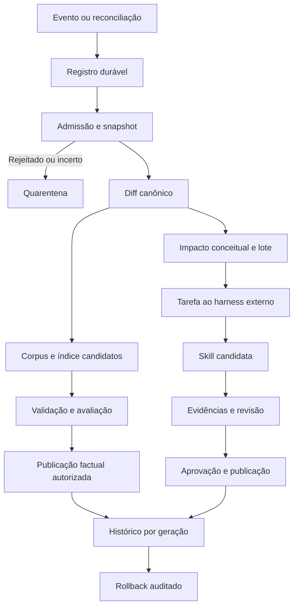

# Especificação — atualização contínua de skill e RAG

Status: **proposta**, revisão documental 1, 2026-09-04.

[Índice](README.md) · [Evidências](EVIDENCE.md) · [Contratos](CONTRACTS.md) ·
[Tickets](TICKETS.md) · [TDD](TDD.md)

## 1. Resumo executivo

**Proposta:** sistema híbrido com RAG atualizado após admissão documental e
skill enriquecida em lotes revisáveis. Conversas geram alegações em quarentena.
Publicar uma candidata exige evidência da composição exata e autorização
apropriada. O DOCOPS permanece determinístico; modelos são executados pelo harness.

O problema é manter atualidade sem perder conhecimento conceitual, misturar
versões ou incorporar erros. O primeiro passo é impedir a substituição silenciosa
da skill enriquecida pelo scaffold, não instalar uma agenda.

Objetivos:

- preservar conhecimento ativo e proveniência;
- automatizar mudanças factuais admitidas sem exigir enriquecimento a cada arquivo;
- oferecer candidata, avaliação, aprovação e rollback;
- detectar defasagem e conflitos;
- medir qualidade e custo por geração;
- aproveitar conversas mediante verificação independente.

Não objetivos: LLM interno, fine-tuning, transcrição/OCR/browser autenticado no
núcleo, fila distribuída, SaaS, publicação irrestrita de fontes, aprendizado
automático de toda conversa ou hot reload universal de harnesses.

## 2. Diagnóstico da arquitetura atual

Os fatos estão rastreados em [EVIDENCE](EVIDENCE.md):

- E01–E02: interfaces públicas, staging, lease, fingerprints e journal já existem.
- E03–E05: a skill básica é scaffold; atualizações efetivas regeneram suas raízes.
- E06–E10: há diff e backend incremental, mas DOCOPS chama force em staging;
  o watcher não é coordenador durável e está desativado no harness gerado.
- E11–E14: há readiness e Golden revisado, sem avaliação completa da resposta
  final nem vínculo de toda evidência aos hashes da composição.
- E15–E17: normalização e segurança têm limites; português exige avaliação própria.
- E18–E19: backup de sucesso é descartado e confirmação do backend precisa endurecer.
- E20–E25: compatibilidade, publicação, seams e pacote vazio têm contratos a preservar.

**Inferência:** a evolução deve aprofundar o motor existente. Outro pipeline em
scripts duplicaria coordenação, recuperação e política de publicação.

## 3. Comparação de alternativas

| Alternativa | Vantagem | Limite | Recomendação |
|---|---|---|---|
| Agenda | Previsibilidade e recuperação de eventos perdidos | Atraso e trabalho sem diff | Reconciliação periódica |
| Cada upload | Atualidade | Arquivo parcial, duplicado ou não admitido | Evento seguido de admissão/debounce |
| Cada vetorização | Sinal de mudança no índice | Reembedding não significa novidade | Avaliar índice, não regenerar skill |
| N documentos | Controle de custo | Quantidade não mede relevância | Gatilho auxiliar |
| Conversas | Decisões e correções reais | Opiniões, alucinação e privacidade | Quarentena verificável |
| RAG rápido/skill em lotes | Atualidade e estabilidade | Defasagem entre camadas | Estratégia central |
| Candidata aprovada | Diff e reversão | Trabalho editorial | Obrigatória para conceitos no piloto |
| Uso e qualidade | Prioriza problemas reais | Popularidade não é evidência | Investigação e Golden candidato |
| Dependência conceito–fonte | Atualização localizada | Metadados adicionais | Evolução progressiva |
| Snapshot/hash | Reconciliação confiável | Custo de varredura | Autoridade final de mudança |
| Validade temporal | Captura envelhecimento | Requer escopo e datas | Complemento para versões e cursos |

## 4. Arquitetura e fluxo completo

Módulos propostos: registro de fontes, coordenador durável, gestor de candidatas
e recepção de propostas de conversas. Aquisição, validação e promoção continuam
no motor atual. O adapter MCP comprova estado e capacidade do backend.

A fila fica fora da árvore ativa substituída na promoção, em diretório privado
configurado e excluído da aquisição e do Git. SQLite local é a primeira escolha;
WAL, se usado, não implica suporte a filesystem de rede. Ver referências em EVIDENCE.

### Histórias de usuário

1. Como operador, quero adicionar fonte sem remover as cadastradas, para ampliar o corpus.
2. Como operador, quero atualizar fatos preservando a skill, para evitar perda de síntese.
3. Como mantenedor, quero ver conceitos afetados, para revisar apenas o necessário.
4. Como revisor, quero diff com evidências, para avaliar a candidata.
5. Como aprovador, quero autorizar hashes exatos, para impedir troca após revisão.
6. Como consumidor, quero identificar a geração, para reproduzir respostas.
7. Como operador, quero retomar jobs, para sobreviver a interrupções.
8. Como mantenedor, quero rollback após publicação, para corrigir regressões.
9. Como usuário, quero propor correção, para melhorar conhecimento sem autoaprovação.
10. Como responsável por dados, quero revogar fontes e derivados, para cumprir o escopo autorizado.
11. Como avaliador, quero comparar versões no mesmo Golden, para medir regressão.
12. Como integrador, quero preservar interfaces existentes, para migrar gradualmente.
13. Como operador, quero distinguir falha de aquisição de remoção, para evitar perda de corpus.
14. Como usuário lusófono, quero citações e busca avaliadas em português, para confiar na resposta.
15. Como mantenedor, quero orçamento e backlog visíveis, para controlar custo e atraso.

Invariantes detalhadas em [CONTRACTS](CONTRACTS.md): indexação opt-in; conteúdo
nunca concede autoridade; candidata não é ativa; aprovação e avaliação têm hashes;
mudança de embedding exige rebuild; aquisição incompleta não remove; Golden gerado
não é revisado; revogação prevalece sobre rollback; sessão identifica geração.

## 5. Política exata de gatilhos

Todos os números são **defaults propostos para o piloto**, sujeitos a D02.

| Condição | RAG | Skill |
|---|---|---|
| Upload finalizado e admitido | Reconciliar | Registrar impacto |
| Arquivo alterado e estável | Diff por hash | Registrar impacto |
| Evento repetido ou mesmo hash | Sem mutação | Sem mutação |
| Metadado alterado | Atualizar proveniência; reindexar só se necessário | Revisar apenas autoridade/validade afetada |
| Reindexação sem diff documental | Nova revisão de índice e avaliação | Não solicitar enriquecimento |
| Embedding alterado | Full rebuild | Preservar skill; invalidar avaliação dependente |
| Remoção confirmada | Retirar do conjunto desejado | Invalidar suporte afetado |
| Fonte revogada | Bloquear consulta e expurgar conforme política | Invalidar derivados imediatamente |
| Contradição confirmada | Evidências marcadas | Candidata prioritária |
| Novidade em conversa | Nenhuma entrada ativa | Proposta em quarentena |
| Métrica pior | Investigação | Candidata somente se causa conceitual |

Debounce: executar no menor prazo entre `último_evento + 60 s` e
`primeiro_evento + 5 min`. Só processar arquivos finalizados. Sem recibo de upload,
exigir hash/tamanho estáveis em duas observações separadas por 10 s. Arquivos
instáveis permanecem pendentes sem reter os demais.

Abrir lote conceitual se houver impacto confirmado ou incerto e ocorrer:

- dez documentos distintos relevantes desde a última candidata;
- pelo menos três documentos relevantes e 10% do corpus ativo afetado;
- uma mudança relevante aguardando há 24 h;
- pelo menos 20 mil caracteres normalizados alterados em um documento relevante;
- incompatibilidade, revogação ou contradição crítica, independentemente do lote.

O denominador de 10% é o corpus ativo no início do lote. Contar cada identidade
lógica uma vez, considerando o último diff líquido; mudanças revertidas à base
saem do contador. Mudanças comprovadamente apenas factuais não contam. Incerteza
produz revisão, não publicação. O contador avança sobre candidatas para evitar
regenerá-las; publicação e cobertura da skill têm cursores distintos.

Limites: uma geração conceitual simultânea por pacote; quatro solicitações de
enriquecimento a cada 24 h. Excedentes ficam no backlog. Revogação invalida
imediatamente mesmo sem orçamento para gerar substituição. Candidata rejeitada
não provoca retry infinito do mesmo conteúdo.

Agenda externa: worker a cada minuto; reconciliação a cada 6 h; triagem de lotes
às 02:00 em America/Sao_Paulo, timestamps em UTC. Commit/tag fixado não avança
automaticamente de versão. A agenda não autoriza indexação ou novas fontes.

Uso: três ocorrências independentes em sete dias abrem investigação; regressão
controlada de Recall/MRR superior a 0,03 também. Aumento de abstention de 10 pontos
percentuais em pelo menos 100 consultas comparáveis gera investigação. Nenhum
desses sinais comprova verdade ou altera sozinho o Golden.

## 6. Ciclo de vida do RAG

1. Registrar origem, direitos, idioma, escopo e modalidade de atualização.
2. Normalizar sem executar conteúdo; registrar hashes original/normalizado e parser.
3. Admitir, rejeitar ou colocar em quarentena.
4. Congelar conjunto desejado e sua completude.
5. Calcular add/update/remove por identidade canônica e hash.
6. Construir índice isolado e verificar erro terminal, documentos e buscas.
7. Avaliar candidata e publicar sob política autorizada.
8. Confirmar consulta após publicação e registrar composição.

Inicialmente usar rebuild isolado por lote. Reaproveitamento real vem depois:
snapshot consistente do backend, identidade de caminhos relocável e aplicação
explícita do diff. Não basta copiar dados de um processo vivo ou trocar force.
Backend incompatível faz rebuild declarado. Mudança de embedding sempre exige
reindex_documents(full_rebuild=True); perfis, revisões, prefixos e dimensões
integram o fingerprint. Alteração de parser/chunker invalida as evidências aplicáveis.

### Prioridade, qualidade e conflitos

Primeiro filtrar pelo projeto, versão e período. Depois avaliar autoridade
aplicável, evidência direta, atualidade no mesmo escopo e qualidade de extração.
Documentação oficial e comportamento reproduzível governam contratos de software;
decisão interna aprovada pode governar escolhas locais. Livro/curso oferece racional,
sem substituir automaticamente contrato atual. Popularidade não define autoridade.

Mesma identidade/hash é repetição. Conteúdo igual em origens distintas pode
compartilhar armazenamento, preservando atribuições e direitos. Similaridade não
autoriza exclusão. Versões distintas podem coexistir. Conflito no mesmo escopo
fica explícito; não resumir duas afirmações incompatíveis como uma regra única.

### Remoção e formatos

Exclusão local confirmada ou tombstone é evidência de remoção. Timeout, robots,
limite de crawl ou sitemap parcial não são. Desaparecimento web exige confirmação
adicional ou inventário autoritativo. Última remoção requer novo estado
retired/not-queryable, preservando a distinção de pacote pronto existente (E25).

| Fonte | Tratamento proposto |
|---|---|
| Livro | Edição, ISBN quando disponível, capítulo/página; síntese em capítulos; direitos explícitos |
| Curso | Autor, versão, módulo/aula e data; separar opinião de contrato verificável |
| Artigo | Autor, publicação, revisão e versão alvo; autoridade por assunto |
| YouTube/transcrição | Conversão externa para Markdown; URL/ID, idioma, autoria e timestamps disponíveis |
| PDF escaneado | OCR externo com versão/confiança; quarentena de extração duvidosa |
| DOCX | Validar perdas de tabelas e elementos fora de parágrafos |
| Planilha | Preservar aba/célula e unidades; não inferir execução de fórmulas |
| Apresentação | Slide como localizador; não fingir entendimento de diagramas omitidos |
| Código | Referência de versão e símbolo; não executar código ingerido |
| Português | UTF-8, acentos e glossário com termos de API; Golden nativo e perfil avaliado |

Não inventar página/timestamp quando o extrator não o preservou. Citar a seção
normalizada e declarar o limite. Não traduzir automaticamente identificadores.
Comparar compact/multilingual em hardware e corpus fixos antes de escolher perfil.

## 7. Ciclo de vida da skill

Preservar ativa → analisar impacto → preparar contexto → executar enriquecimento
externo → receber candidata → validar estrutura e fontes → avaliar comportamento
→ revisar → aprovar hashes → publicar → monitorar.

A tarefa externa contém base, snapshot, diff, política, idioma, arquivos permitidos,
orçamento, limites de tamanho e exigência de referências por afirmação. O resultado
inclui ferramenta/versão e hashes. Não inclui chaves ou conversa integral.

O SKILL.md permanece síntese curta; usar teto de 4 mil tokens como objetivo do
projeto e capítulos sob demanda. Definir tokenizer ou estimador versionado na
validação; não declarar contagem exata sem método. Manter glossário, padrões e
exceções, em vez de acumular todo fato literal no arquivo principal.

| Artefato | Atualização |
|---|---|
| Corpus e sources.json | Mudanças factuais e proveniência admitidas |
| index.json | Construção e estado do backend comprovados |
| Skill e capítulos | Mudança conceitual aprovada |
| Router | Política, escopo, conflito ou tratamento de defasagem alterados |
| Manifesto | Nova composição e seus estados |
| Harness | Contrato/forma de carregar geração alterados |
| Golden candidato | Geração automática permitida |
| Golden revisado | Revisão humana independente |

Skill pode derivar de corpus anterior; registrar cobertura e conceitos afetados.
Conceito sem suporte válido deve exigir RAG ou abstention. Invalidar automaticamente
uma recomendação revogada não significa inventar uma substituta automaticamente.

## 8. Conversas como fonte segura

A unidade é uma alegação, não o chat inteiro. Registrar trecho mínimo autorizado,
autor, tipo, escopo, versão, privacidade e referências.

| Tipo | Destino |
|---|---|
| Preferência pessoal | Memória privada autorizada; fora da skill compartilhada |
| Decisão do projeto | Registro pendente de responsável |
| Correção factual | Fonte primária ou experimento reproduzível |
| Observação experimental | Condições, resultado e limites |
| Hipótese/opinião | Quarentena |
| Resposta do agente | Sem autoridade independente |
| Pergunta sem resposta | Investigação e candidato Golden |

Detecção: buscar conhecimento existente; comparar entidade/relação/valor/condições;
classificar conhecido, reformulação, novo, contraditório ou não verificável;
registrar suporte e oposição. Falha de retrieval não prova novidade; similaridade
não prova verdade. Repetição e feedback positivo não são evidências independentes.

Captura desativada por padrão. Admissão exige autorização de uso, privacidade
adequada, origem e evidência verificável. Decisão interna aprovada comprova decisão
local, não lei universal. Proponente não pode se autoaprovar por campos no texto.
Quarentena não é pesquisável pelo RAG ativo. Revogação percorre derivados.

## 9. Estados, versões, aprovação e rollback

Ver [CONTRACTS](CONTRACTS.md) para transições e envelopes. Separar documento, job,
candidata, publicação e proposta de conversa. Readiness não equivale a aprovação.

Identificar corpus_revision, index_revision, skill_revision, router_revision,
golden_revision, policy_revision e release_id. Versão da fonte não é versão da skill
nem versão do DOCOPS. Hashes excluem timestamps, durações e autorreferências.

Aprovação vincula hashes, base, avaliação, política, identidade e papel do aprovador.
Alteração invalida aprovação. Avanço da ativa causa stale_base; rebase exige nova
evidência e revisão pertinente. JSON com approved=true não autentica aprovador.

Retenção inicial: cinco últimas gerações e todas dos últimos 30 dias, além das
fixadas por sessões. Retenção é sujeita a quota e revogação. Rollback valida e
reativa composição completa, com novo evento auditado, sem ressuscitar fonte revogada.
cleanup de resíduos permanece separado da retenção editorial.

Sessões fixam geração. Sessões novas recebem nova publicação; antigas recarregam
explicitamente ou seguem fixadas. Revogação crítica bloqueia uso de geração antiga.
Nenhum mecanismo apaga conhecimento já carregado no contexto de um modelo.

## 10. Alterações por arquivo, módulo e contrato

| Área | Arquivos existentes | Mudança proposta |
|---|---|---|
| Motor | operations.py, api_types.py | Proteção, camadas, candidata, publicação condicionada |
| Geração | generation.py | Inventário/hash e propriedade de artefatos |
| Fontes | state.py, web_acquirer.py, repository_acquirer.py | Conjunto desejado/completude/proveniência |
| RAG | rag_sync.py, runtime.py | Estado terminal, perfil real e negociação de capacidade |
| Evidências | readiness.py, divergence.py, manifest.py | Identidade da composição e invalidação |
| Avaliação | evaluator.py, retrieval.py | Métricas novas e resultado externo do harness |
| Integração | harness.py, templates/router.md | Geração fixada e tratamento de defasagem |
| Formatos | normalizer.py | Localizadores e transformações rastreáveis |
| Validação | package_validator.py, contracts.py | Contratos novos e migração explícita |
| Interface | __init__.py, __main__.py | Extensões mínimas públicas |
| Novos módulos | candidates.py, coordination.py, source_policy.py, learning.py | Ciclo editorial, fila, admissão e conversas |
| Backend vendor | mcp_server/server.py e config.py | Consulta restrita e snapshot consistente futuro |
| Contratos | schemas/ e docops/schemas/ | Cópias equivalentes e exemplos válidos/negativos |
| Scripts | update_skill.ps1, update_rag.py | Wrapper seguro e compatibilidade sem segundo motor |
| Documentação | USE, ARCHITECTURE, SCHEMAS, HARNESSES, PUBLISHING-POLICY, tests/SEAMS | Operação, segurança e migração |
| Privacidade | .gitignore e auditor de release | Excluir fila, conversas e candidatas privadas |

Os caminhos de módulos Python desta tabela são relativos a docops/, exceto quando
explicitamente indicados. Os tickets fornecem links navegáveis para os arquivos.
Não modificar o contrato vigente apenas para fazê-lo parecer compatível com algo
ainda não implementado. Campos novos são aditivos; mudança de semântica/enum exige
versionamento e migração correspondente.

## 11. Testes e critérios de aceitação

[VALIDATION](VALIDATION.md) define A01–A16, fórmulas, baseline e gates. Testar
interfaces públicas, resultados e artefatos; nenhum helper privado, ordem de
chamadas ou consulta direta às tabelas da fila. Usar fixtures sintéticas,
relógio controlado e backend real na integração. Avaliação do modelo é externa.

O teste histórico de 15 casos aprovados protege comportamento existente; não
comprova a funcionalidade desta especificação nem os thresholds propostos.

## 12. Implementação em fases

| Fase | Tickets | Entrega |
|---|---|---|
| 1 | T01–T03 | Proteção, identidade e separação factual/conceitual |
| 2 | T04–T09 | Candidata manual, evidência, aprovação e rollback |
| 3 | T10–T14 | Fontes, fila, worker, gatilhos e sessões consistentes |
| 4 | T15–T16 | Reaproveitamento do índice e diversidade linguística/formato |
| 5 | T17–T18 | Conversas verificadas e melhoria orientada por uso |

Ver [TICKETS](TICKETS.md) para bloqueios reais: fases são marcos de entrega, não
dependências artificiais entre todos os itens. Ativar publicação factual automática
somente após consulta restrita, sessões consistentes e recuperação comprovada;
até então jobs podem preparar candidatas para promoção manual.

## 13. Riscos, custos, limitações e decisões pendentes

Custo total = aquisição + normalização + embeddings + avaliação + enriquecimento
externo + revisão humana + armazenamento. Medir CPU, memória máxima, documentos e
chunks reprocessados, tokens, latência por fase, espaço e minutos de revisão.
Não há estimativa monetária confiável sem volume/hardware/harness escolhidos.

Riscos: perda de enriquecimento, defasagem, remoção indevida, evidência obsoleta,
snapshot inconsistente, custo de rebuild, extração incompleta, contaminação por
conversa, arquivos privados em histórico, prompt injection e reload não suportado.
Mitigar pelos gates específicos; não confundir hashes com assinatura/autoria.

Revisão humana permanece para classes novas de fonte/direitos, conceitos,
conflitos de autoridade, decisões internas, Golden, mudanças de política,
perfil de embedding, publicação externa e exceções de segurança. Licença MIT do
código não concede direitos sobre documentos, vetores ou derivados.

[DECISIONS](DECISIONS.md) registra responsáveis ainda não definidos, opções e
momentos de decisão. A criação deste plano não autoriza essas mudanças.

**Primeiro ticket: T01. Primeiro RED:** atualização após enriquecimento deve
preservar a ativa e bloquear sobrescrita. **GREEN mínimo:** inventário com hashes
e guarda antes de qualquer substituição, sem fila, LLM ou indexação nova.
